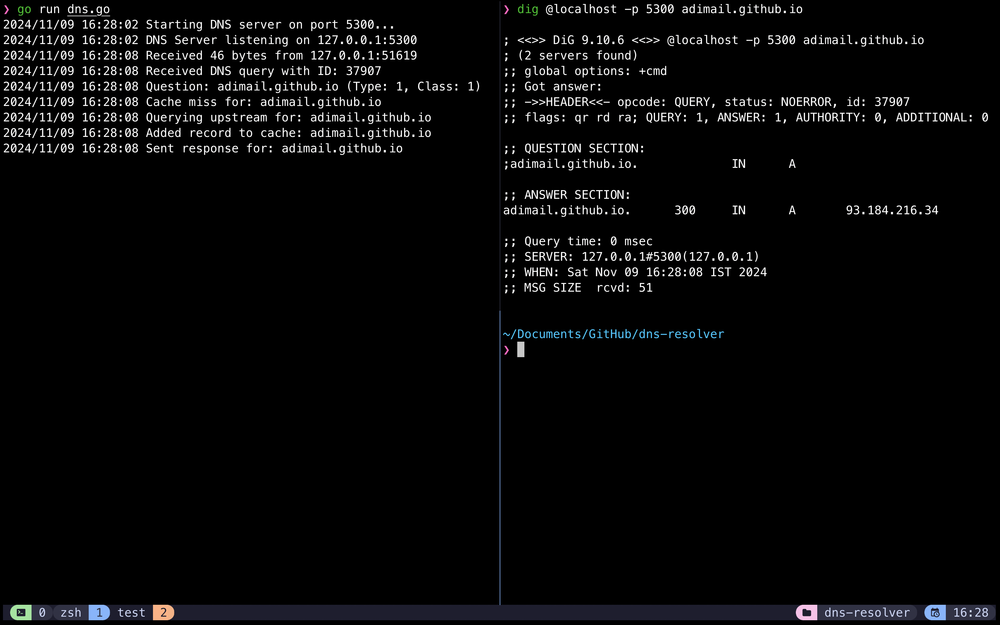

# DNS Resolver

This project is a simple DNS resolver written in Go, aimed at understanding DNS fundamentals, nameservers, DNS records, and caching.

## Goals

- Understand DNS concepts and how it works.
- Learn about nameservers and DNS record types.
- Implement caching

## DNS Records

- **A (Address)**: Maps a domain to an IPv4 address.
- **CNAME (Canonical Name)**: Maps a domain to another domain.

During a DNS lookup, the resolver primarily searches for the `A` record, which maps a domain to an IPv4 address. If the requested domain has a `CNAME` record instead, the resolver recognizes it as an alias pointing to another domain. The resolver will then recursively query the specified domain in the `CNAME` record, either checking its cache or contacting an upstream DNS server to resolve the ultimate `A` record associated with the final domain.

---

## How It Works

This DNS resolver operates by:

1. Listening for DNS queries over UDP.
2. Parsing the DNS queries into structured headers and questions.
3. Checking a local cache for responses to improve performance.
4. Querying an upstream DNS server if the record is not cached.
5. Sending a response back to the client.

The resolver includes a basic caching mechanism to store DNS responses temporarily, avoiding unnecessary upstream lookups and improving response times.

---

## Screenshots



_On the left terminal, the Go DNS server is running on `port 5300`, and it logs the activity as it processes a DNS query. The logs show that the server received a DNS query for `adimail.github.io` (type `A` record), detected a cache miss, and queried an upstream DNS server to resolve the domain. After obtaining the IP address (93.184.216.34, this is `DUMMY DATA`), it cached the record and responded to the client._

_On the right terminal, the `dig` command was used to query the custom DNS server running locally on port 5300. The output confirms that the server successfully resolved adimail.github.io to 93.184.216.34._

---

## Instructions to Build and Run the Project

### Prerequisites

- Go installed on your system.

### Steps to Run

1. **Clone the repository:**
   ```bash
   git clone https://github.com/adimail/dns-resolver.git
   cd dns-resolver
   ```
1. **Run the DNS resolver:**
   ```bash
   go run dns.go
   ```
1. **Test resolver:**

   ```bash
    dig @localhost -p 5300 google.com
   ```
